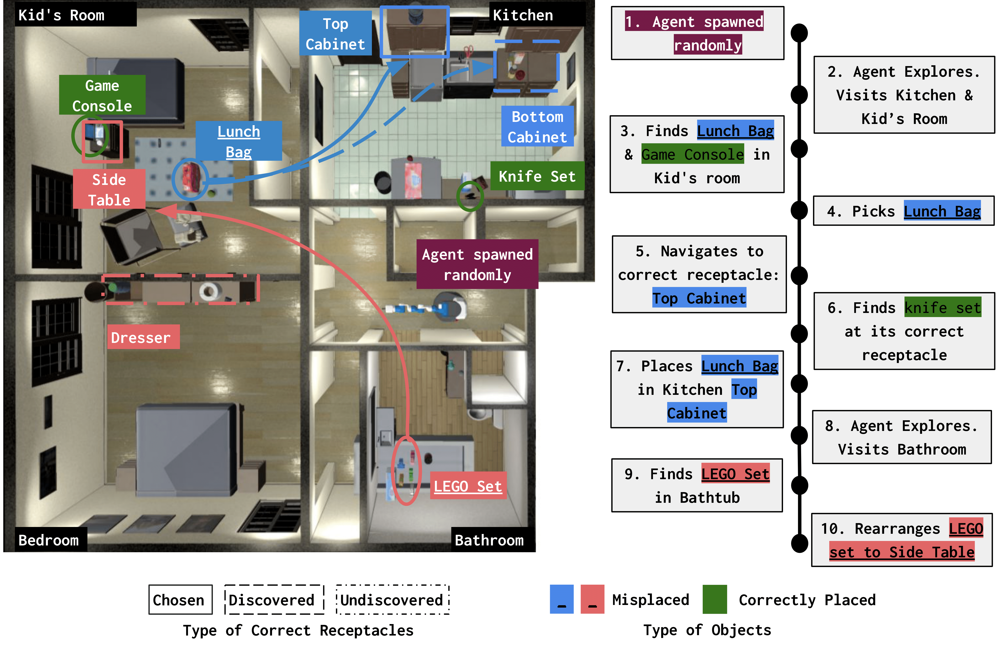

# Housekeep

This repository contains the implementation of our ECCV 2022 paper [Housekeep: Tidying Virtual Households using Commonsense Reasoning](https://arxiv.org/pdf/2205.10712.pdf)



## Dependencies Installation

- Setup Python `conda create -n habitat python=3.7 cmake=3.14.0`
- Install habitat-sim `conda install habitat-sim==0.2.1 withbullet headless -c conda-forge -c aihabitat`
- Clone this repo and get all submodules for this repo: `git submodule init`, `git submodule update`

#### Habitat Lab
- Go into Habitat Lab directory `cd habitat-lab`
- Install requirements `pip install -r requirements.txt`
- Install development version of Habitat Lab `python setup.py develop --all`

#### Additional Installs
- Install A* path planner `cd cos_eor/explore/astar_pycpp && make && cd -`
- Install additional requirements with `pip install -r requirements.txt` in the base directory

#### Data
Find the instructions for downloading object models from different sources and for setting up our data directory [here](data/README.md).

The file `cos_eor/scripts/dump/scale_rots_all.npy` contains metadata information for the complete collection of object models. It includes the scales and rotations to use for placing these object models appropriately in the scenes.

## Running the baseline
- Generate config files for running the experiments `./generate_configs.sh <exp_name> <explore_type> <rank_type>`
`<explore_type>` is the type of exploration module to use: `phasic` or `oracle`
`<rank_type>` is the ranking function to use: `LangModel` or `Oracle` <br><br>
This will create configuration files for all scenes inside `./logs/<exp_name>/configs`. Edit the configuration files to change other properties.

- Run hierarchical policy on a scene (eg. `ihlen_1_int`)
`./run_cli.sh <exp_name> <scene_name> <num_episodes>`
The experiment logs will be written inside `logs/<exp_name>` directory.

## Aggregating results
Use the following command to aggregate metrics across scenes and save the aggregated values (average values with standard deviations) to a file:
`python cos_eor/scripts/aggregrate_metrics.py --metrics-files logs/<exp_name>/metrics-{<scene_names>}* --subsplit <subsplit> --out-file <save_path>`. <br>
`<scene_names>` is a comma separated list of scene names. Set this to `ihlen_1_int,merom_1_int` when evaluating on val scenes and `beechwood_1_int,benevolence_1_int,ihlen_0_int,merom_0_int` when evaluating on test scenes.<br>
Use `<subsplit>` (set to either `all`, `seen` or `unseen`) to indicate if the metrics are to be aggregated across all episodes or across only the episodes containing seen or unseen objects.

## Citing

If you find our work useful for your research, please consider citing:

```
@misc{kant2022housekeep,
            title={Housekeep: Tidying Virtual Households using Commonsense Reasoning},
            author={Yash Kant and Arun Ramachandran and Sriram Yenamandra and Igor Gilitschenski and Dhruv Batra and Andrew Szot and Harsh Agrawal},
            year={2022},
            eprint={2205.10712},
            archivePrefix={arXiv},
            primaryClass={cs.CV}
}
```
